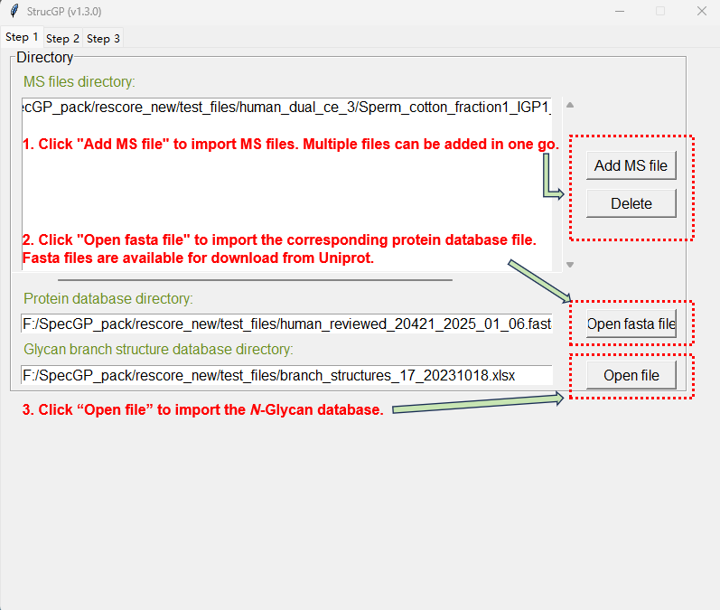
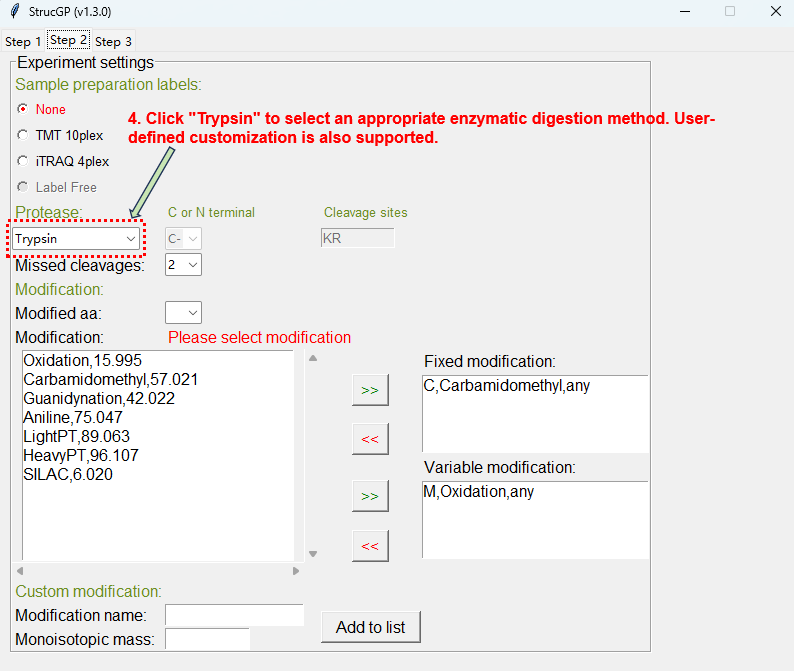
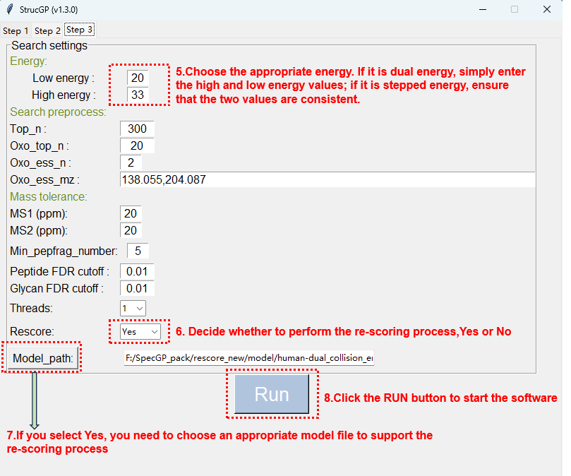

# SpecGP
A Transformer-Based Model for Predicting Energy-adaptable Structural Spectra of Glycopeptides.

### The source code can be obtained via the Code Ocean repository link provided in the manuscript.

The GitHub repository will be made public after the article is published.

# StrucGP_1.3.0
### Here, we release a new version of StrucGP, which incorporates the re-scoring system based on SpecGP.

Operating system and software:Windows 11、10 or Windows 7 Service Pack 1 above, Windows Server 2012 or above.  
Hardware: Intel or AMD x86-64 processor, 4.0 GHz processor with 64 GB RAM

### Instructions for use
For the detailed usage of StrucGP and the method to obtain the license, please refer to the original article at https://doi.org/10.5281/zenodo.4925441. Below is a brief explanation for StrucGP use and an introduction to the usage of the integrated SpecGP re-scoring system.

1\. Run main.exe file(in StrucGP_1.3.0 folder), you can see the GUI interface along with a command console.

2\. 'step 1' tab, click "Add MS file" to import the raw files to be searched against the database; 
click "Delete" to remove the selected raw files; 
click "Open fasta file" to select the matched protein database(downloaded from https://www.uniprot.org/);
click "Open file" to select the branching database of glycan chains(in StrucGP_1.3.0 folder).

3\. 'step 2' tab, select the appropriate enzyme digestion method, 
maximum number of missed cleavage sites, 
modifications and other relevant information.

4\. 'step 3' tab, select the appropriate energy parameters(if you want to analysis MS file with stepped collision energy, set the high and low energy to the same.), 
ppm tolerance, number of threads, 
and re-scoring related parameters.

Three models are provided in the StrucGP_1.3.0/models folder for users to choose from, corresponding to human and mouse configurations for dual collision energy and stepped collision energy settings. If users need a custom model, they can utilize SpecGP to complete model training.

5\. When the program finishes running, a result file with the suffix 'after_rescoring.xlsx' will be generated in the same directory as the raw file as the final identification result. Taking the AMD Ryzen 9 9900X CPU and the Windows 11 operating platform as an example, glycan identification takes about 30 minutes, while re-scoring takes about 15 minutes.

Contact
====
If you have any questions or suggestions, please contact sun\_glycolab@126.com or post issues at Github(https://github.com/Sun-GlycoLab/StrucOGP).
